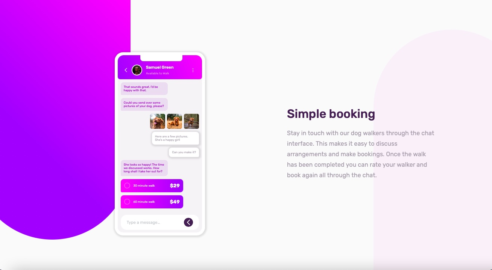
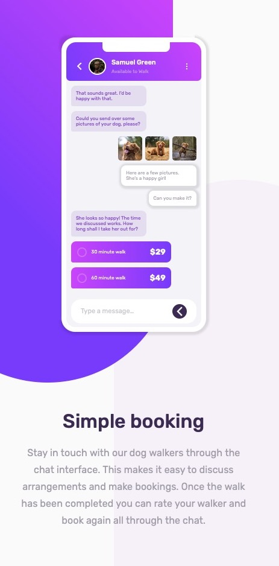

# Chat App CSS Illustration

This project is a chat app CSS illustration created for a [Frontend Mentor challenge](https://www.frontendmentor.io/challenges/chat-app-css-illustration-O5auMkFqY). The objective was to build out the feature illustration using HTML and CSS, making it look as close to the provided design as possible. The challenge involved practicing responsive design and using various CSS techniques to position and style the elements.

## Demo
[Live Demo](https://bright-licorice-2f95fd.netlify.app/)

## Project Screenshots

## Features

- Responsive Design: The layout adjusts seamlessly to different screen sizes, providing an optimal viewing experience on both desktop and mobile devices.
- CSS Illustrations: All elements, except for the provided images, were created using HTML and CSS, showcasing creative use of CSS for illustrations.
- CSS Pseudo-elements: Utilized ::before and ::after pseudo-elements to create the background.
- CSS Flexbox and Grid: Implemented CSS flexbox and grid for efficient layout management and alignment of elements.
- CSS Positioning: Applied various CSS positioning techniques to accurately place elements according to the design specifications.

## Built With

- React JS
- HTML
- CSS
